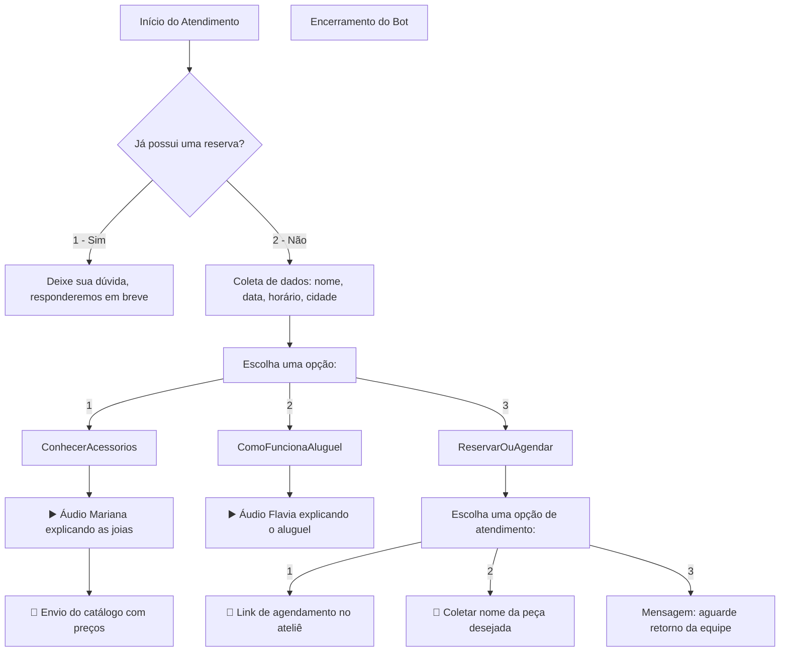

# 🤖 Chatbot WhatsApp – Ateliê Essence Noivas
Proposta de Chatbot para WhatsApp, Solução Completa de Automação de Atendimento.

## 📈 Fluxo Conversacional (Em produção/validação. Mermaid)

### 1. Plataforma de Chatbot no WhatsApp

Você precisará de uma **integração com a API oficial do WhatsApp** ou com uma **plataforma intermediária**, como:

| Opção | Vantagem | Custo estimado |
|-------|----------|----------------|
| **360dialog** | Compatível com WhatsApp Business API | ~$5–$15/mês + mensagens |
| **Z-API / ChatPro / CloudAPI** | Alternativas mais acessíveis e fáceis de implementar | ~R$ 50–100/mês |
| **Twilio** | Robusto, documentação top | ~$0.005/mensagem + $5/mês |
| **WATI / Gupshup** | Tudo pronto, interface web, suporte à automação | ~$30/mês (básico) |

**Sugestão**: para um MVP rápido e barato, **Z-API ou ChatPro** funcionam bem.

### 2. Plataforma de Agendamento

Você pode usar:

| Opção | Vantagem | Custo |
|-------|----------|-------|
| **Calendly** | Interface pronta, links personalizáveis | Gratuito / Pro ~$8/mês |
| **Google Agenda + Formulário** | Fácil integração, gratuito | Gratuito |
| **TidyCal** | Alternativa barata (lifetime) | ~$29 vitalício |

**Sugestão**: **Calendly** com plano gratuito já resolve para um fluxo simples.

### 3. Backend para lógica e fluxos

Você pode montar o fluxo do bot em:

| Opção | Vantagem |
|-------|----------|
| **Node.js com Express** | Flexível, ótimo para APIs REST |
| **Dialogflow** | Interface de fluxo com IA + webhook |
| **n8n** | Automação visual de fluxos (low-code) |

### 4. Armazenamento e Integrações

* **Google Sheets**: para armazenar leads e agendamentos (via webhook)
* **Supabase / Firebase** (opcional): se quiser escalar depois

### 5. OpenAI (opcional)

Se quiser que o bot tenha **respostas com IA**, você pode usar a OpenAI:
* **GPT-4 Turbo**: $0.01/1k tokens entrada | $0.03/1k saída
* Pode ser usado para refinar respostas ou gerar mensagens simpáticas.

# Proposta de implementação

## 💵 Orçamento Estimado (produção única)

| Item | Descrição | Valor (R$) |
|------|-----------|------------|
| Levantamento e estruturação de fluxo | Reuniões, análise, prototipação | 100 |
| Implementação do bot e integração | Fluxo com menu, envio de áudio, integração com API de WhatsApp | 350 |
| Integração com Calendly / Google | Agendamento com link | 100 |
| Testes e ajustes finais | Garantia de funcionamento, UX básico | 100 |
| Deploy e entrega + treinamento | Implantação e mini manual | 100 |
| **Total estimado** | | **R$ 750** |

## 🛠️ Tecnologias e Serviços Recomendados

| Item | Opção Sugerida | Custo Estimado | Finalidade |
|------|----------------|----------------|------------|
| Plataforma WhatsApp | Z-API / ChatPro | R$ 50–100/mês | Integração com WhatsApp Business |
| Agendamento | Calendly Free | Gratuito | Link de agendamento externo |
| Hospedagem Bot / Backend | Replit / Render / Vercel | Gratuito (inicial) | Executar webhook de fluxo se necessário |
| Armazenamento de dados | Google Sheets | Gratuito | Registro dos dados recebidos |
| Áudios | MP3 no Google Drive | Gratuito | Envio automático pelo bot |

## 💸 Assinatura Mensal Recomendada (Opcional)

| Item | Valor Sugerido |
|------|----------------|
| Licença da API de WhatsApp | R$ 50–100 |
| Suporte e manutenção simples | R$ 50 |
| **Total mensal estimado** | **R$ 100–150** |

## 🚀 Benefícios do Projeto

* Atendimento automatizado e profissional
* Redução de tempo da equipe com perguntas recorrentes
* Agendamentos organizados com link direto
* Pronto para evoluir com IA ou painel no futuro

Proposta elaborada por:  
**Valdei / Pixel Nibble Studio**  
📧 valdei.ferreira.jr@gmail.com  
📱 (16) 98234-8966